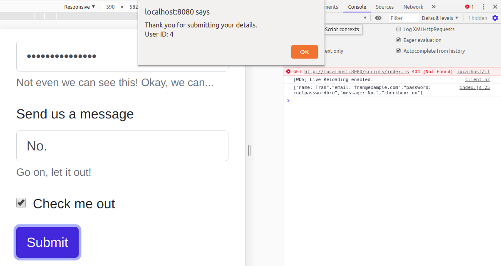

# Submit me 

**Aufgabe**: 

* Schau dir das Formular in der HTML-Datei an. Füg in `index.js` einen Event-Handler für `submit` hinzu, der einen Post-Request macht.

**Anforderungen**: 
* Nutze fetch um den Post-Request zu machen. 
* Nutze die `async await`-Syntax.
* Wenn die Promise aufgelöst wird, soll in der Console eine Ausgabe des JSON erscheinen.
* Mach einen Alert wenn das Formular abgeschickt wird.

* Du kannst [JSONPlaceholder](https://jsonplaceholder.typicode.com/) benutzen um den Post-Request zu machen. 

